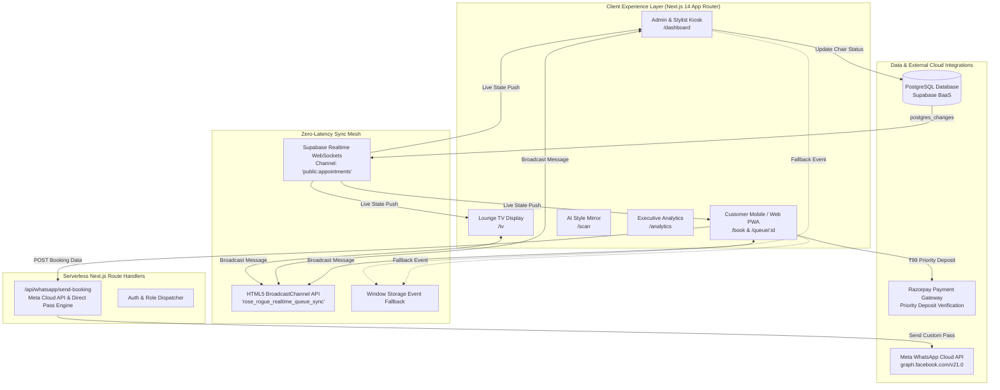
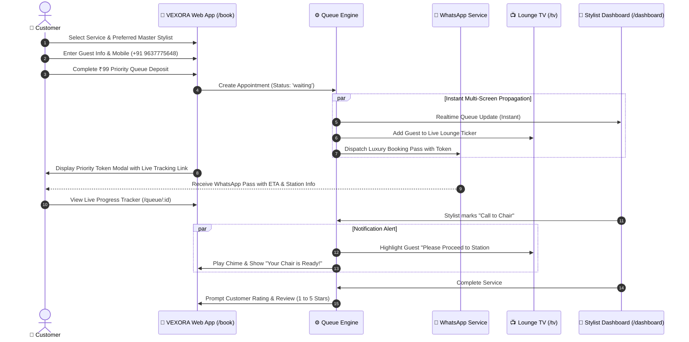

<div align="center">

# 🌹 VEXORA
### Intelligent Luxury Salon Queue & Client Flow Ecosystem

[](https://nextjs.org/)
[](https://reactjs.org/)
[](https://www.typescriptlang.org/)
[](https://tailwindcss.com/)
[](https://supabase.com/)
[](https://developers.facebook.com/)

*Effortless Styling. Zero Waiting Anxiety.*

---

</div>

## 📌 Table of Contents
1. [Problem Statement (PS)](#-problem-statement-ps)
2. [The Solution](#-the-solution)
3. [Unique Features (USPs)](#-unique-features-usps)
4. [System Architecture](#-system-architecture)
5. [User Flow Diagrams](#-user-flow-diagrams)
6. [Tech Stack](#-tech-stack)
7. [Project Directory Structure](#-project-directory-structure)
8. [Setup & Installation](#-setup--installation)
9. [Hackathon Demo & Pitch Guide](#-hackathon-demo--pitch-guide)

---

## 🛑 Problem Statement (PS)

Modern luxury salons and styling studios face a systemic operational breakdown:

1. **The Fragility of Rigid Scheduling:**
   - Traditional appointment books rely on static scheduling. When a single client arrives 10 minutes late or a color treatment takes longer than estimated, the entire daily schedule cascades into chaos.
   - Stylists get overwhelmed, chairs sit unproductively between delays, and clients endure unexpected waiting room delays.

2. **Customer Waiting Anxiety & Walk-in Blind Spots:**
   - Walk-in guests have zero visibility into their actual wait times, creating frustration and high lobby abandonment rates.
   - Salons lack a transparent, dignified way to manage walk-ins without noisy lobby calls or disorganized paper clipboards.

3. **Disjointed Salon Ecosystems:**
   - Front desks, stylist stations, and customer phones operate in disconnected silos. There is no synchronized real-time heartbeat coordinating client arrivals, chair transitions, and waiting lounge displays.

---

## 💡 The Solution

**VEXORA** replaces rigid, fragile scheduling with an **adaptive, real-time client flow ecosystem**. 

Instead of forcing appointments into rigid time buckets, VEXORA continuously computes live expected chair calls based on active stylist status, service durations, and queue depth. It connects clients, stylists, front-desk managers, and lounge displays into a single, cohesive real-time web application.

- **For Clients:** Frictionless booking, verified priority entry passes, instant WhatsApp confirmations, and a live progress tracker accessible from any browser with zero app installation.
- **For Stylists & Floor Managers:** A responsive Command Dashboard (`/dashboard`) with one-click chair progression, stylist load balancing, and smart treatment overlap detection.
- **For the Waiting Lounge:** A cinema-grade Ambient TV Queue Display (`/tv`) that eliminates waiting anxiety by keeping guests continuously informed in luxurious aesthetic clarity.

---

## ✨ Unique Features (USPs)

### 1. 🔄 Zero-Latency Multi-Screen Synchronization
- Powered by a hybrid real-time engine (**Supabase Realtime WebSockets** + native browser **BroadcastChannel API** + **Storage Events**).
- When a customer checks in or a stylist calls a client, the **Admin Dashboard**, **Customer Tracker**, and **Lounge TV Display** update instantaneously across screens with **0ms latency** without full-page reloads.

### 2. 📺 Cinema-Grade Waiting Lounge TV Display (`/tv`)
- Purpose-built for wall-mounted 4K/1080p smart TVs in luxury salon lobbies.
- Features a live queue ticker, an "Up Next" guest spotlight, real-time wait estimation counters, and active chair occupancy statuses in a rich Parisian aesthetic.

### 3. 📲 Omnichannel WhatsApp Pass & Realtime Alerts
- Dispatches formatted luxury booking confirmations directly to the client's WhatsApp containing their Token ID (`#SQ-101`), assigned master stylist, estimated arrival window, and a one-tap live queue tracking link.
- Features both direct Meta WhatsApp Cloud API integration and an instant 1-click WhatsApp Pass fallback (`wa.me`) that bypasses network firewall restrictions.

### 4. 🪞 AI Style Consultation & Face Analysis Mirror (`/scan`)
- An interactive digital styling mirror that scans facial features, evaluates structure, and recommends tailored hairstyles, cuts, and color treatments suited to the client's profile.

### 5. 💈 Intelligent Treatment Overlap Engine
- Identifies efficiency opportunities on the salon floor: when a client is in active color processing (where hair sits for 30–45 minutes), the engine prompts staff that the chair is free for a quick precision cut or trim, maximizing salon chair revenue.

### 6. 📊 Real-Time Business Intelligence & Stylist Analytics (`/analytics`)
- Executive analytics dashboard tracking real-time revenue, chair occupancy rates, peak footfall hours, stylist performance metrics, and customer review scores.

---

## 🏗️ System Architecture



---

## 🔁 User Flow Diagrams

### End-to-End Customer Booking & Arrival Flow



---

## 💻 Tech Stack

| Domain | Technology | Description |
| :--- | :--- | :--- |
| **Framework** | **Next.js 14.2 (App Router)** | Full-stack architecture hosting UI pages and backend route handlers |
| **UI & Logic** | **React 18.3 & TypeScript 5.7** | Strongly typed, reactive component hierarchy |
| **Styling** | **Tailwind CSS 3.4 & PostCSS** | Custom Parisian luxury palette (Warm Terracotta, Cream, Charcoal) |
| **Animations** | **Framer Motion 11.18** | Fluid, 60fps micro-interactions and modal transitions |
| **Icons & Audio** | **Lucide React & Web Audio API** | Crisp vector iconography and audible lobby chimes |
| **Database** | **Supabase (PostgreSQL)** | Row-Level Security, relational integrity, and automated timestamps |
| **Real-Time Sync** | **Supabase WebSockets + BroadcastChannel** | Multi-tier sync engine delivering instant updates across tabs & devices |
| **Messaging** | **Meta WhatsApp Cloud API & wa.me** | Automated digital passes and customer status alerts |

---

## 📁 Project Directory Structure

```
d:/VEXORA HACKATHON
├── src/
│   ├── app/
│   │   ├── layout.tsx                # Root layout, typography, theme provider
│   │   ├── page.tsx                  # Luxury Hero Landing Page & quick access
│   │   ├── book/page.tsx             # Bespoke Priority Reservation Portal
│   │   ├── queue/[id]/page.tsx       # Live Customer Progress Tracker
│   │   ├── dashboard/page.tsx        # Staff & Stylist Management Kiosk
│   │   ├── tv/page.tsx               # High-Resolution Ambient Lounge TV Display
│   │   ├── analytics/page.tsx        # Salon Performance & Revenue Intelligence
│   │   ├── scan/page.tsx             # AI Mirror & Facial Consultation Scanner
│   │   └── api/whatsapp/send-booking # Serverless WhatsApp Dispatch Route Handler
│   ├── components/
│   │   ├── QueueTokenModal.tsx       # Digital Pass Ticket Modal with WhatsApp Action
│   │   ├── QueueProgressTracker.tsx  # Step-by-step progress visualizer
│   │   ├── RazorpayModal.tsx         # Priority Deposit Verification Modal
│   │   ├── StylistRatingModal.tsx    # Customer Star-Rating & Review Dialog
│   │   └── Navbar.tsx                # Omnipresent luxury navigation header
│   ├── lib/
│   │   ├── supabaseClient.ts         # Real-time multi-tier sync engine
│   │   ├── queueEngine.ts            # Wait time calculator & overlap detection
│   │   ├── whatsappService.ts        # Luxury WhatsApp pass generator & formatter
│   │   ├── stylistAvailability.ts    # Live stylist schedule & chair availability
│   │   ├── mockUsers.ts              # Luxury Indian customer & stylist profiles
│   │   └── types.ts                  # Core TypeScript domain models
│   └── styles/
│       └── globals.css               # Tailored luxury aesthetic tokens & print styles
├── supabase/
│   └── schema.sql                    # PostgreSQL schema definition
├── tailwind.config.ts                # Custom color scales & design system
├── package.json                      # Dependencies & NPM scripts
└── README.md                         # Complete project documentation
```

---

## 🚀 Setup & Installation

### Prerequisites
- [Node.js](https://nodejs.org/) (v18.17 or higher)
- `npm` or `yarn`

### 1. Clone & Install Dependencies
```bash
cd "d:/VEXORA HACKATHON"
npm install
```

### 2. Configure Environment Variables
Create a `.env.local` file in the project root:
```env
# Supabase Configuration (Optional for Cloud DB, local fallback active)
NEXT_PUBLIC_SUPABASE_URL="your-supabase-url"
NEXT_PUBLIC_SUPABASE_ANON_KEY="your-supabase-anon-key"

# Meta WhatsApp Cloud API Configuration
META_WHATSAPP_ACCESS_TOKEN="your-meta-access-token"
META_WHATSAPP_PHONE_NUMBER_ID="your-phone-number-id"
```

### 3. Run the Development Server
```bash
npm run dev
```
Open [http://localhost:3000](http://localhost:3000) in your browser.

---

## 🏆 Hackathon Demo & Pitch Guide

For the highest impact presentation before judges, execute the following 3-minute flow:

1. **Split-Screen Demo (The Showstopper):**
   - Open [`http://localhost:3000/dashboard`](http://localhost:3000/dashboard) on the left half of your screen.
   - Open [`http://localhost:3000/tv`](http://localhost:3000/tv) on the right half of your screen.
   - Click **"Call Next"** or **"Start Service"** on the Dashboard.
   - **Point out to the judges:** The TV screen updates *instantly with zero refresh delay* via the internal BroadcastChannel and WebSocket engine.

2. **Customer Priority Booking Flow:**
   - Navigate to [`http://localhost:3000/book`](http://localhost:3000/book).
   - Select a service (e.g., *Parisian Precision Cut*) and assign an expert stylist.
   - Complete the reservation and show the **Official Digital Token Pass (`#SQ-101`)**.
   - Click **"Open in WhatsApp"** to show the pre-formatted luxury confirmation pass ready to send.

3. **Live Progress Journey:**
   - Open the tracking pass at [`/queue/[id]`](http://localhost:3000/queue).
   - Demonstrate the live progression timeline, sound effects chime, and post-service rating modal.

4. **Executive Insights & AI Style Mirror:**
   - Showcase [`/analytics`](http://localhost:3000/analytics) for chair occupancy and revenue intelligence.
   - Showcase [`/scan`](http://localhost:3000/scan) for the interactive facial consultation experience.

---

<div align="center">
  <sub>Crafted for the Vexora Hackathon • Redefining Salon Hospitality & Flow</sub>
</div>